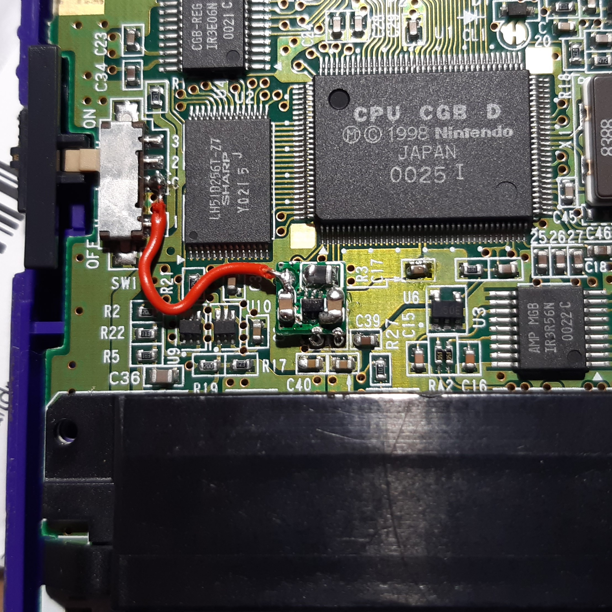
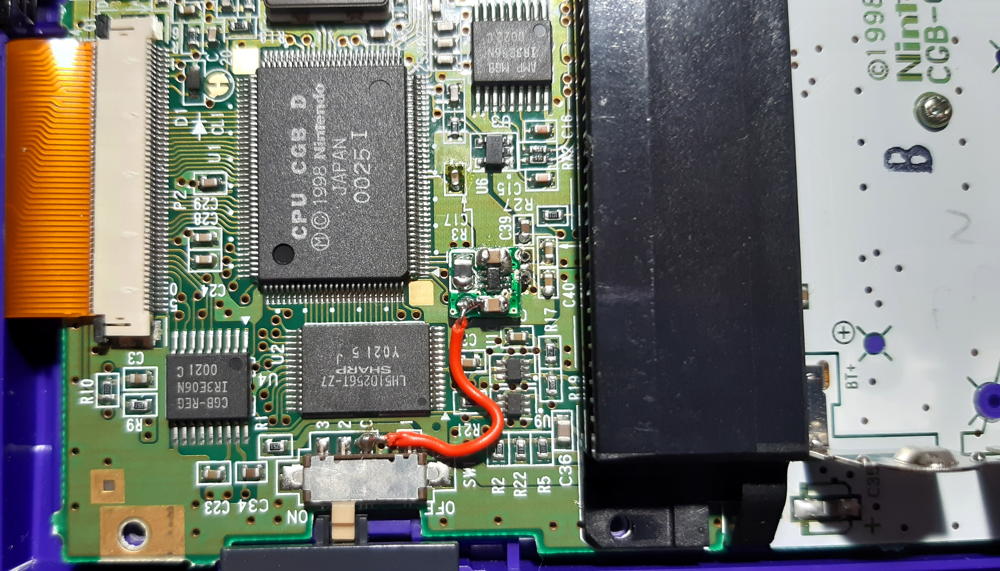
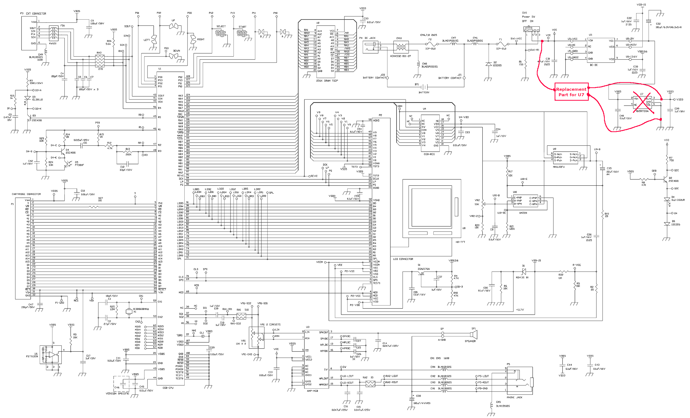
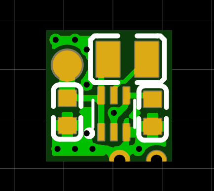
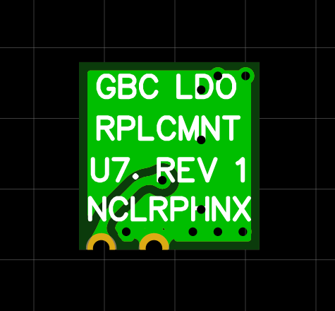
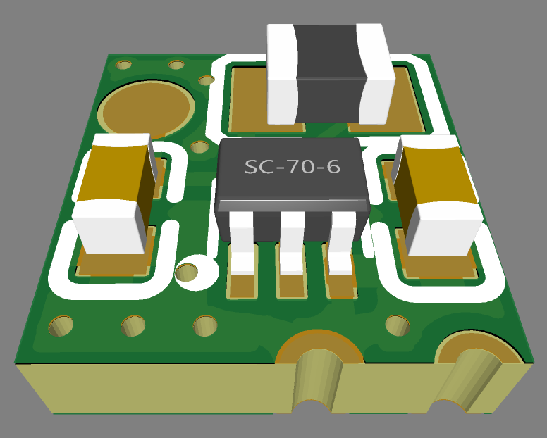

# GBC-LDO-Replacement

Replacement part for the linear regulator `U7` on the Game Boy Color. Reduces power usage a tiny bit and saves resources from the main switch mode power supply.

The original linear regulator was designed to use the 5V of the main regulator board and drop that down to 3.3V. This is very inefficient since you first go through the efficiency of the main power supply (unknown) and then drop a lot of that power (33%!) again over the linear regulator.

In practice, only very little power is used on the 3.3V rail (I measured roughly 4 mA), so YMMV. You'll maybe get like another half an hour of extra battery life, but why the heck not, right?

The replacement part is a highly efficient switch mode power supply chip with some support parts on a tiny PCB that fits right on top of the SOT-23-5 pads of the original regulator. It also skips the main power supply completely and instead gets its power directly from the battery via the power switch. Here are some images:

All the necessary parts and schematics for the part can be found in the [hardware folder](/hardware).

To use it, remove the SOT-23-5 linear regulator `U7` from the board and solder the replacement to the two outer-most pads of the 3 pads on the bottom. The middle pad on the bottom and the two pads on top will not be soldered. Then solder a wire to the power switch pad labeled `C` and the pad on your replacement part. That's it! The PCB fits very nicely in there and is held on by the two pad connections to the main PCB of the GBC.

Here is a schematic of the GBC and how the replacement part integrates into all of the circuitry:

	
	

While you're at it, replace the electrolytic caps `C32` (100µF, 6V), `C35` (22µF, 16V) and `C38` (100µF, 4V) on the bottom portion of the main PCB near the batteries with new ceramic or tantalum caps.
